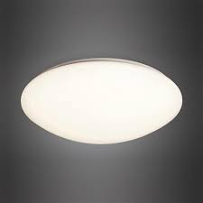
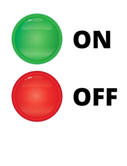
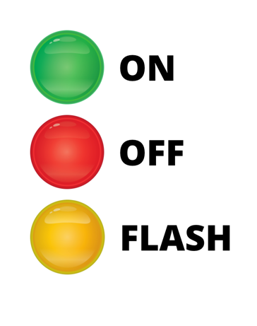
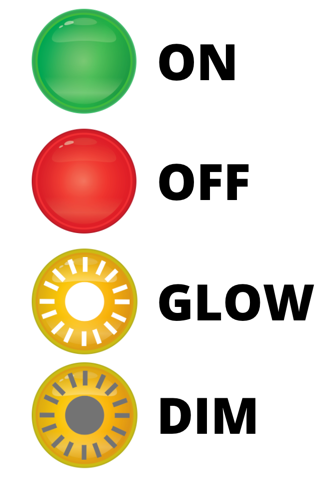

# Bridge Pattern

A mechanism that decouples an interface(hierarchy) form the implementation(hierarchy)

## Example

Dimmable light:


*3 Brands (with their own implementations) :*
- Philips
- GE
- Sony

*3 type of Remotes (with additional features):*
- Simple ON/OFF
- Remote with Flash
- Remote with Dim & Glow

Simple Remote | Remote with Flash | Remote with dim & glow 
-- | -- | --
 |  |  

### Class Hierarchy - complex & unscalable one
 

This is one way to architect this lesson, We can clearly see a class explosion happening in the above representation. We have this complex hierarchy.
- At the top we have our `SimpleRemote`
- Below that we have `RemoteWithDimAndGlow`, `RemoteWithFlash` and also companies specific `PhilipsSimpleRemote`, `GESimpleRemote` & `SonySimpleRemote`
- We have similar structures below `RemoteWithDimAndGlow` & `RemoteWithFlash`

The problem with this structure is that it is very inflxible. So tomorrow if you want to support a new type of remote control, let's say a `RemoteWithTimer` in which we could set time after which the light will turn off, We have to add a new class called `RemoteWithTimer` and under that we will be required implementation of `RemoteWithTimer` for every DimmableLight Brand that we support. If tomorrow we want to support a new Light brand, say LG, we should add one class called `LGRemote`, and add implemention of `LGRemote` for every type of remote.

So every time we support a new type of remote cotrol or a new brand of Light, we should add a bunch of new classes to this hierarchy. Overtime, this hierrachy is going to get very complex and unmaintainable. 

The reason we ended up with this structure is because our hierarchy is growing in two different dimensions. On the one side we have this sea green classes, these are all about **features** (abstraction) of the remote control. So, we have different kinds of remotes.

We have this another dimension which is all about **implementation** or light brands, which are coloured purple in our above representation. To simplify this hierarchy, we need to break this down into half. 

On one side we should have a hierarchy which is all about the features. On the second side we should have a separate hierarchy, which is all about implementation. We should have two completely independent hierarchy. 

A Bridge is the name given to the compositional relationship between the RemoteControl (feature) and the DimmableLight (implementation).

So, a remote control targets a particular Dimmable light.

### Class Hierarchy - much more scalable


In the RemoteControl, we are going to have a filed for the DimmableLight and we are going to initialize this field using the constructor of the remote control. So when you want to create a remote control object, you are going to give it a concrete DimmableLight implementation, such as a SonyDimmableLight.  

At RemoteControl class, we are simply talking to an abstraction (DimmableLight abstract class).

### Complete example

DimmableLight interface/abstract class
```
class DimmableLight {
  turnOn() { /* abstract */ };
  turnOff() { /* abstract */ };
  flashLight() { /* abstract */ };
  dim(value) { /* abstract */ };
  glow(value) { /* abstract */ };
}
```

Concrete DimmableLight implementations
```
class PhilipsDimmableLight extends DimmableLight {
  turnOn() { console.log(`Philips dimmable light: Turn on`); };
  turnOff() { console.log(`Philips dimmable light: Turn off`) };
  flashLight() { console.log(`Philips dimmable light: Flashing light`) };
  dim(value) { console.log(`Philips dimmable light: Dimming light by ${value}`) };
  glow(value) { console.log(`Philips dimmable light: Glowing light by ${value}`) };
}

class GEDimmableLight extends DimmableLight {
  turnOn() { console.log(`GE Dimmable light: Turn on`); };
  turnOff() { console.log(`GE Dimmable light: Turn off`) };
  flashLight() { console.log(`GE Dimmable light: Flashing light`) };
  dim(value) { console.log(`GE Dimmable light: Dimming light by ${value}`) };
  glow(value) { console.log(`GE Dimmable light: Glowing light by ${value}`) };
}

class SonyDimmableLight extends DimmableLight {
  turnOn() { console.log(`Sony Dimmable light: Turn on`); };
  turnOff() { console.log(`Sony Dimmable light: Turn off`) };
  flashLight() { console.log(`Sony Dimmable light: Flashing light`) };
  dim(value) { console.log(`Sony Dimmable light: Dimming light by ${value}`) };
  glow(value) { console.log(`Sony Dimmable light: Glowing light by ${value}`) };
}
```

Different remote controls with different features. They are composed with a dimmableLight instance.

```
class SimpleRemote {
  constructor(dimmableLight) {
    this.dimmableLight = dimmableLight;
  }

  turnOn() { this.dimmableLight.turnOn() };
  turnOff() { this.dimmableLight.turnOff() };
}

class RemoteWithDimAndGlow extends SimpleRemote {
  constructor(dimmableLight) {
    super(dimmableLight);
  }

  turnOn() { this.dimmableLight.turnOn() };
  turnOff() { this.dimmableLight.turnOff() };
  dim(value) { this.dimmableLight.dim(value) };
  glow(value) { this.dimmableLight.glow(value) };
}

class RemoteWithFlash extends SimpleRemote {
  constructor(dimmableLight) {
    super(dimmableLight);
  }

  turnOn() { this.dimmableLight.turnOn() };
  turnOff() { this.dimmableLight.turnOff() };
  flashLight() { this.dimmableLight.flashLight() };
}
```

client/usage:
```
let remoteControl = new RemoteWithDimAndGlow(new SonyDimmableLight());
remoteControl.turnOn();
remoteControl.dim(10);
```


