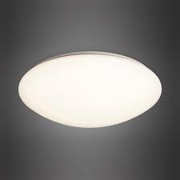
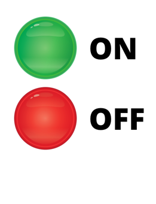
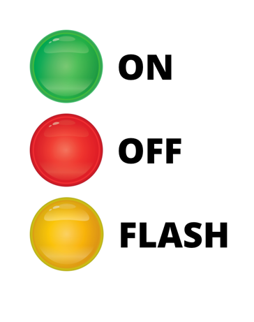
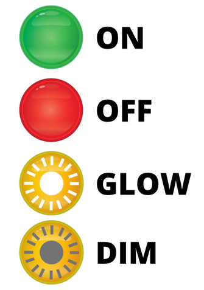

# Command Pattern

**Command** is a behavorial design pattern that turns a **request** into a **stand-alone object** that contains all information about the request. This transformation let's you parameterize methods whith different requests, delay or queue a request's execution, and support undoable operations.

In many ways, you see examples of the command pattern all around you in software. For instance, a menu in an image manipulation software allows you to color correct or add filter effects to a photo. In this case, the intricacies of the individual commands are unknown to the menu, which we'll call as the **invoker**. 

The **invoker** is used by the **client** to invoke a command. *It doesn't need to know how the command works on the inside*. 

So, the command design pattern essentially contains an **invoker** object which is designed to **execute** a given **command**. Every command must encapsulate its internals, and should expose an **execute** function which the **invoker** will execute. This interface should remain consistent across all commands. Additionally, the invoker could keep a stack of commands that have been executed, and allow undoability. 

Most applications such as text, code, and image-editing apps allow you to undo the last command or a series of commands in the last-in, first-out order. 

The commands themselves affect or modify a **receiver** which receives the end result of the command being executed. Commands can inherit from a base Command class that should minimally offer an execute method and an undo method. 

This is one of the best explaination of the Command Design Pattern in plain english. I'll encourage you to go through it once and then we'll implement the same LCD Light example as explained by [
Christopher Okhravi](https://www.youtube.com/watch?v=channel/UCbF-4yQQAWw-UnuCd2Azfzg) in the video using Javascript. I stumbled upon this video while searching for a simple yet very real word example. I loved the example and the expaination of the concept by [
Christopher Okhravi](https://www.youtube.com/watch?v=channel/UCbF-4yQQAWw-UnuCd2Azfzg).

<p></p>
<p></p>

<iframe width="560" height="315" src="https://www.youtube.com/embed/9qA5kw8dcSU" frameborder="0" allow="accelerometer; autoplay; clipboard-write; encrypted-media; gyroscope; picture-in-picture" allowfullscreen></iframe>

<p></p>
<p></p>

## Example
Let's start with a very simple example so that we can focus on the concept. Also, the example represents a very real world use case of the command design pattern.

In our example the **receiver** is a dimmable light: 



Our **receiver** just exposes two methods:
- currentBrightness() : returns the current brightness of the light
- changeBrightness(newBrightnessValue) : that changes the brightness of the light.

We, as developers, have been given the task of programming the following **invoker**: 



Our **Invoker** is a simple remote control with two buttons - `onButton` and the `offButton`. As per the requirements of the client, the `onButton` should make the brightness of our **receiver** => `100` and the `offButton` should make it `0`.

We, as great developers, decided to organize our code with the **Command Pattern** for the following reasons:

By our experience, we know that the client wont stop here. It is most likely that they would come up soon with **invokers** similar to the following:

Remote with Flash | Remote with dim & glow
-- | --
 | 
The flash button increases the brightness up to 100, keeps it at 100 for 3 seconds and then drops it back to 0 | The dim button reduces the brightness by 5 and the glow button increases the brightness by 5

So we want to decouple the objects of our application. We want to keep the commands separate from the invokers, so that the same commands could be **resued** in other invokers.

Also, a **command** like **flash** is clearly a combination of **OnCommand** and **OffCommand**. **Flash** basically turns `on` the light after 2 seconds and turns it `off` after few seconds. How will we be able to **re-use** and **combine** the existing code, that we wrote for the first **invoker** if that code sits inside the invoker.

The class of the receiver (our dimmable light) could look something like this:
```
class LCDLight {
  constructor() {
    this.brightness = 0
    console.log(`WELCOME ::: New LCD light instantiated.`);
    console.log(`CURRENT BRIGHTNESS ::: ${this.brightness}`);
  }

  currentBrightness() {
    return this.brightness;
  }

  changeBrightness(newBrightnessValue) {
    let oldValue = this.brightness;
    this.brightness = newBrightnessValue;
    console.log(`${oldValue} BRIGHTNESS value changed to :::=> ${this.brightness} `);
  }
}
```
It has just two simple public methods `currentBrightness()` & `changeBrightness(newBrightnessValue)`. 

Our first **Invoker** for a simple remote control with just on and off button could look something like this:
```
class SimpleOnOffRemote {
  constructor(onCommand, offCommand) {
    this.history = [];

    // loading the buttons of the remote with the commands
    this.on = onCommand
    this.off = offCommand
  }

  // our on button handler of the remote.
  pressOn() {
    this.on.execute();
    this.history.push(this.on);
  }

  // our off button handler of the remote.
  pressOff() {
    this.off.execute();
    this.history.push(this.off);
  }

  // Genieric method to execute any command implementing a certain interface.
  executeCommand(command) {
    command.execute();
    this.history.push(command);
  }

  // Generic method to undo the last command in the history
  undo() {
    const cmd = this.history.pop();
    cmd.undo();
  }
}
```

**SimpleOnOffRemote** is a very simple **invoker** remote with just two buttons, **on** and **off**. We need to **load it's buttons with commands** with a method called **setCommand(Icommand)** or passing the commands in the **constructor**. In this example we will pass the commands in the **constructor**.

The end goal of the invoker is to act upon the receiver using a `command` like this:
```
simple_on_off_remote_object.executeCommand(new LightOnCommand(light_one))
``` 
or 

```
simple_on_off_remote_object.pressOn();
```

The command is supposed to implement an `execute()` mehtod and an `undo()` method. We just load the relevant **commands** to the invoker & invoke the `execute()` or `undo()` method of the **command** on different event handlers.

The **lightOnCommand** could look something like this:
```
class LightOnCommand { 
  constructor(light) {
    this.light = light; // a receiver 
  }

  // Execute command will change the value of the receiver.
  // These are commands and not queries; so they performs its duty; 
  // it doesnot return anything.
  // its simple. the point that we are encapsulating something (likely simple) so that we can pass it around.  
  execute() {
    this.light.changeBrightness(100);
  }

  undo() {
    this.light.changeBrightness(0);
  }
}
```

At the time of construction the command is supposed to be loaded with all the information if requies to perform its task. We atleast need to send in the receiver object on which the task needs to be performed. by passing in the receiver object itslf, we have given the command a full access to all its public properties and methods.

The **LightOffCommand** could look something similar like this:
```
class LightOffCommand { 
  constructor(light) {
    this.light = light; // a receiver 
  }

  execute() {
    this.light.changeBrightness(0);
  }

  undo() {
    this.light.changeBrightness(100);
  }
}
```

And it's usage (**client**) could look something like this:
```
const light_one = new LCDLight();

// we can load our commands to the invoker.
const simple_on_off_remote = new SimpleOnOffRemote(new LightOnCommand(light_one), new LightOffCommand(light_one));

simple_on_off_remote.pressOn();
simple_on_off_remote.pressOff();
simple_on_off_remote.undo();
```

## New feature request

Now, our client needs us to implement a new Invoker remote, that has and extra button called the **Flash** button, which just takes up the brightness of the light to 100 and then drops it back to 0. But, since we are smart and we had already planned for such a change, it's going to be easy-pizzy.

Our **LigtOnThenOffCommand** will simple use the existing commands like this:

```
class LigtOnThenOffCommand {
  constructor(light) {
    this.onCommand = new LightOnCommand(light);
    this.offCommand = new LightOffCommand(light);
  }

  execute() { 
    setTimeout(() => { this.onCommand.execute()}, 2000)
    setTimeout(() => { this.offCommand.execute()}, 3000)
  }

  undo() {
    console.log(`this command doesnot have an undo operation.`);
  }
}
```

Here's how our new invoker would look like. We'll need to load it with three commands, one for each button.

```
class LightRemoteWithFlash {
  constructor(onCommand, offCommand, flashCommand) {
    this.history = [];
    this.on = onCommand;
    this.off = offCommand;
    this.flash = flashCommand;
  }

  // our on button handler of the remote.
  pressOn() {
    this.on.execute();
    this.history.push(this.on);
  }

  // our off button handler of the interface.
  pressOff() {
    this.off.execute();
    this.history.push(this.off);
  }

  // our flash button that turns on the light for just 3 seconds and than turnds off
  pressFlash() {
    this.flash.execute();
    this.history.push(this.flash);
  }
  

  // Genieric method to execute any command.
  executeCommand(command) {
    command.execute();
    this.history.push(command);
  }

  // Generic method to undo the last command in the history
  undo() {
    const cmd = this.history.pop();
    cmd.undo();
  }
}
```

Usage: 
```
const on_off_flash_remote = new LightRemoteWithFlash(new LightOnCommand(light_one), new LightOffCommand(light_one), new LigtOnThenOffCommand(light_one));

on_off_flash_remote.pressOn();
on_off_flash_remote.pressOff();
on_off_flash_remote.pressFlash();
```

Do you see that we could pass the very same light Object that we instantiated to test our first invoker. Super powerful & super fexible!! Awesome!!

## Another feature request

Now, our client has come up with another new invoker - A remote with two new buttons - one to **dim** the light and another to **glow** the light. Again because of the Architecural design of our application, it's going to be eezy-pizzy for us.

Here's our new commands. Simple and familir, isn't it :
```
class LightDimCommand { 
  constructor(light) {
    this.light = light; // a receiver 
  }

  execute() {
    this.light.changeBrightness(this.light.currentBrightness() - 5);
  }

  undo() {
    this.light.changeBrightness(this.light.currentBrightness() + 5);
  }
}
```
```
class LightGlowCommand { 
  constructor(light) {
    this.light = light; // a receiver 
  }

  execute() {
    this.light.changeBrightness(this.light.currentBrightness() + 5);
  }

  undo() {
    this.light.changeBrightness(this.light.currentBrightness() - 5);
  }
}
```

Here's our new **Invoker** which loads the four relevant commands.
```
class LightRemoteWithDimAndGlow {
  constructor(onCommand, offCommand, dimCommand, glowCommand) {
    this.history = [];

    this.on = onCommand;
    this.off = offCommand;
    this.dim = dimCommand;
    this.glow = glowCommand;
  }

  pressOn() {
    this.on.execute();
    this.history.push(this.on);
  }

  pressOff() {
    this.off.execute();
    this.history.push(this.off);
  }

  pressDim() {
    this.dim.execute();
    this.history.push(this.dim);
  }

  pressGlow() {
    this.glow.execute();
    this.history.push(this.glow)
  }
  
  executeCommand(command) {
    command.execute();
    this.history.push(command);
  }

  undo() {
    const cmd = this.history.pop();
    cmd.undo();
  }
}
```

**That's pretty much it 😇! You may access the complete source code [here](./script.js).**

**Also, you would like to practice these patterns in your local with the following [playground](https://github.com/vivmagarwal/js-design-patterns).**
