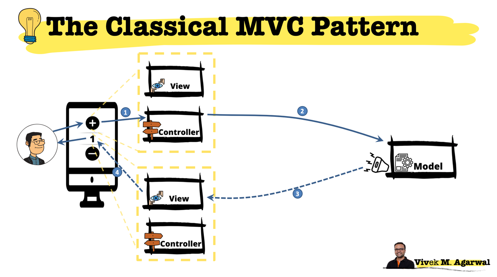
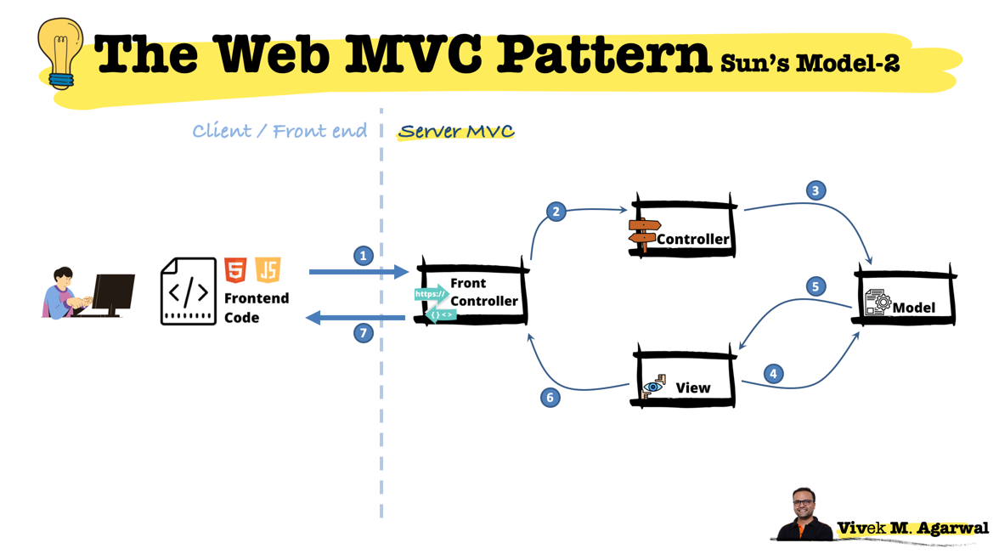
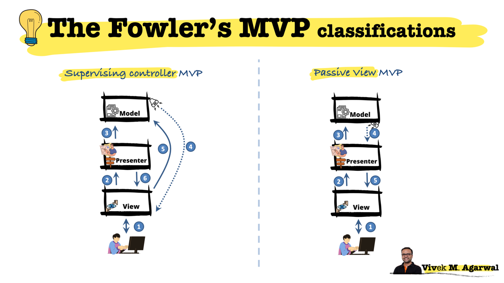
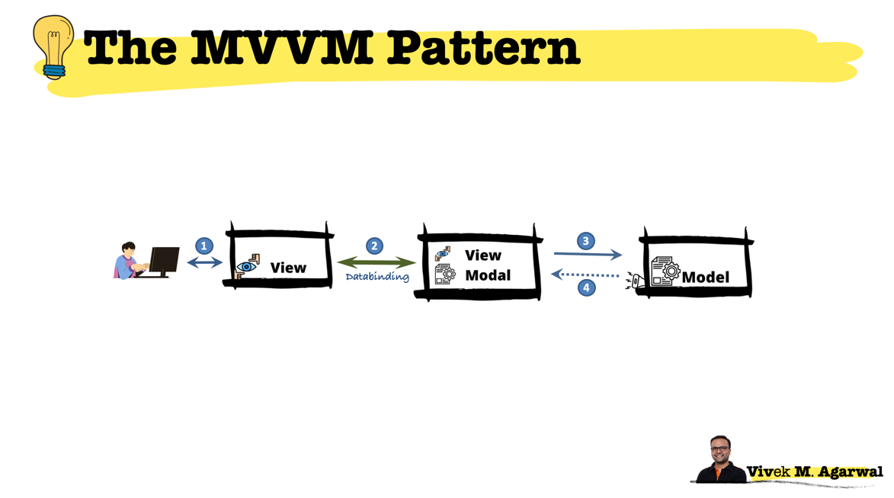

# MVC Pattern 

**M** - Model | 
**V** - View | 
**C** - Controller

 

## The classical desktop MVC

**Dataflow:**

1 User presses the `+` button which is handled by the **controller** associated with the `+` button.

2 The **controller** calls some method in the **model** to update the **model**.

3 The model publishes an event. It doesnot care about any thing else. It's upto view's to subscribe to the model and act upon the event it raises.  

4 In our above example the view associated with the label control with displays `1` listens to the event and acts accordingly by increasing the controls text to `2`

**Trygve Reenskaug** introduced MVC into Smalltalk-79 while visiting the Xerox Palo Alto Research Center (PARC) in the 1970s. In the 1980s, Jim Althoff and others implemented a version of MVC for the Smalltalk-80 class library.

Let's first get familiar with the original idea of MVC before moving into how it is implemented these days. 

In the MVC architecture that Trygve Reenskaug came up with, there's a **Model** object which hides some very small business rules.

The job of the **controller** is to gather input from some device (keyboard, mouse whatever). And the **controller** will then translate those gestures from the device into method calls against the **Model**. The **Model** is not allowed to know what **devices** control it. The Model is not allowed to know from where it get's its input from. That is the job of the **controller**. Also, the controller has the power to decide wether to call modal functions or not. For simple visual effects, the controller may choose to directly talk with the view.

There is an observer relationship in between the **View** and the **Model**. The **View** *registers* with the **Model** & the **Model** *calls-back* to the **View** through an observer like pattern and tells the **View** that I have changed and you better re-display me.

The job of the **View** is to then present the data within the **modal** appropritely to the user. 

**Controller** : Input

**Model** : Process

**View** : Output

The important thing here to note about this design is that the model and the view never iteract with each other & any interactions in between them happens through the controller. This means that the presentation of data & the logic are completely separated which makes creating complex applications much easier.

MVC is an architechural design pattern that encourages improved application organization through a sepratation of concerns. It enforces the isolation of business data (Models) from user interfaces (Views) with a third component (Controllers) traditionally manging modal and user-input.

The original idea was to seprate the logic from the user interface. The idea was that decoupling these parts of the application would also allow the reuse of models for other interfaces in the application.

**Understanding Smalltalk'80's architecture:**

- A Model represented domain specific data and was ignorant of the user interface and logic
- A View represented the current state of a Model
- The Observer pattern (Pub/Sub) was used for letting the View know wnenever the Model was updated or modified
- Presentation was taken care by View
- The Controllers role was primarily to handle user interaction & making decisions for the View

In those days, the MVC was used in the small. We had an MVC for the button, another MVC for the text box and another for a group of radio buttons. We din't had A MVC for the entire page. That's a much later invention.

## The Webserver MVC - Similar to Sun Micorsystem's Model-2

1 Here's the web is sitting to the left. First, the web server invokes one of the **controllers** after it receives the url (or a http request or a getter/putter or something like that) from the Frontend. Typically there's **front controller** or a **front interactor** that handles the interaction between the Front End and the Back End. Almost every server side framework will have a front-controller which exposes only the necessary interface to front end application developers. 

2 the **front-controller** passes on the request to the **controller**

3  The **controller**'s job is to unpack all the strange parameters that came in through the URL (or the webform or whatever) and then call the business objects in the **model**. Controller in the web mvc has more responsiblity. It is in charge of general HTTP request lifecycle. Note that while in classical MVC, controller responds to the user inputs, here it responds to user HTTP requests delegated by web framework.

Having called the business objects, the **controller** passes control to the **view**. 

4 The **view** queries the business objects in the **model** and  

5 The **view** typically gets back some raw data.

6 the server side **view** processes the raw data into easy to consume response and sends it back to the **front-controller**. 

7 the **front-controller** sends back the response to the **client** or the front-end code that invoked it.   

One of the problems with this architecture is that there are no solid boundaries here. What happens is that controllers and views like functions could end up in business objects. Most of the times it's because of carelessness by the one writing the code. Business stuff gets into view. Basically there are no good boundaries & you can loose contorl of it if you are not disciplined. 

Model doesnot implement Observer as View is not active. Controller directs the Model to perform business logic and passes the control to View for further output. View queries the modal to get the data and typically generates serialized HTML or JSON.

The front-controller is ta component typically provided by the underlying technology stack to handle HTTP reqest. For example Java has `Servlet` and our Node.js has `HTTP.Server`

## The Webserver MVC - with client-modal (CMMVC)

The **client-modal-mvc** is very similar to the **Model-2 MVC**. The only difference you will notice is that now, the client (or the front end code) has access to a client-modal which typically is a normalized subset of actual server-modal.

This small change, opens up a range of possilities at the front end. The front-end code could directly interact with the client-modal which can significantly reduce the server cycles. Things like form submission, input validation etc can be handled by the client side code.

For the backend architectures as well, it opens up a number of possiblities. There could be several variations of CMMVC. For example, the client-modal could take in all the requests from the client and make a decision to send the data back to the client or to involve the server-side controller in the process. 

## The Frontend MVP Pattern

We are now starting to move MV*'s which are equally relevant to the Frontend architecture as they are to the Backend architecture. During his research and preparation of material on presentation layer patterns, Martin Fowoler decided that the treatment gien to the design intentions behind **Model** - **View** - **Presenter** can be devided under the names **Supervising Controller** and **Passive View**.

### The Supervising Controller MVP Pattern

1 The **User** interacts with the **View**

2 **Views** delegate user events to the **Presenter** 

3 The **Presenter** interacts with the Business objects (**Modal**)

4 **Modal** is independent and raises **events**

5 For **simple presentation logic**, the **View** uses data binding techniques and/or **observer pattern** to update itself when changes occur within the application

6 **Complex presentation logic**, particulary any logic one desires to unit test, is handled by the interaction of the **Presenter** and the **View**.

The Supervising Controller pattern separates an application's concerns of presentation and presentation logic into the specialized compoents of View and Controller, with the View assigned the responsibility of simple presentation logic and presenter (controller) assigned the responsibilites of responding to user input and handling complex presentation logic. The **View** is the visual components used within an application such as screens and widgets. The **Presenter** is a component which processes user events and complex presentation logic.

### The Passive View MVP Pattern

1 The **User** interacts with the **View**

2 The **Views** delegates user events to the **Presenter**

3 The **Presenter** interacts with the business objects (**Modal**)

4 **Modal** raises an event which is subscribed and listened by the **Presenter**. It can either be a PubSub/Observer releation or a query-response relation.

5 The **Presenter** prepares everything that View needs and updates the **View**. **View** is quite passive here. The View maintaines no link to the Modal and relies solely on the presenter for all presentation logic. The presenters within pattern take on mediating role between the Views and Business logics. 

Most of the significant processing about the presentation is done by the presenter. The goal is to make the view super stupid. All it needs to do is to grab code form view model and stick it to screen without any processing.

The Passive view pattern separates an applications concerns of Presentation and Presentation logic into the specialized components of View and Presenter, with the presenter (contorller) taking on the responsibility for responding to user events and presentation logic. View is the visual component used within an application such as screens and widgets. The Controller is a component which processes user events and the presentation logic within an application.

MVP is equally popular in the Server side world. It has a hard architecutral boundary that separates the business rules from the Web(or whatever else you are using).  

The UI is dependent on the business logic. Basically the UI in MVP is a plug-in to the business rules. The business rules in this pattern are immune to the UI's that plugs in. UI's are dependent on the business rules and not the other way round. The UI is going to change more than business logic, isn't it. 

In the server version of the MVP we have an **interactor** that creates the **response model** using the **entities**. The interactor is going to take the **response model** and pass it out through the **output boundary** to a **presenter**. 

The **presenter** is an object whose job is to take the **respoinse model** and translate it into a **view model**. 

The **response model** has data in it which was created by the interactor as a result of a usecase. But, this data is not presentable.  It is the job of the **presenter** to trun them into presentable **formatted strings**. 

Most of the significant processing about the presentation is done by the **presenter**. The goal is to make the **view** super stupid. All it needs to do is to grab code form **view model** and stick it to screen without any processing. 

We can clearly see the plugin architechure here. We have our hard boundary. We can deploy both the sides independently. To re-compile the GUI side we dont need to recompile the rest of the code. That's one of the goals of the MVP.

## MVVM - Model View ViewModel Pattern

MVVM is the basis of many front-end libraries like Angularjs, Vue, React etc. MVVM is similar to the Passive View MVP pattern. MVVM is able to eliminate lots of boiler plate code that we see in the PV-MVP because of the **Data-binding** mechanism between ViewModel (**Presenter**) and the **View**.

**Data-binding** is a programming technique that binds data sources from the provider and consumer together and synchromizes them. It helps our application get rid of lots of boilerplate code that we traditionally need to keep View and Model in Sync.

1 End user interacts with the **View**. The view is the structure, layout and the appearance that the user sees on the screen. 

2 **ViewModel** is an object that exposes **bind-able properties** and methods which are consumed by the **View**. This **Binder** is responsible for keeping the View in sync with the **ViewModel**. Every time a property on **ViewModel** changes, **View** is automatically updated to reflect the changes in the UI. The view forwards user interactions to the viewModel via data-binding (properties, event callbacks etc). 

3 **ViewModel** queries the **Model**

4 **Model** emits events with are listened by the **ViewModel**. **ViewModel** updated itself & thanks to the data binding, the View gets updated automatically. 

The Model-view-viewmodel is a software architectural pattern that facilitates the separation of the development of the GUI be it via markup language or from the developmen tof the backend logic. View is not dependent on any specific model platform.

The view model is responsible for converting the data objects from the model in such a way that objects are easily manged and presented. View-model handles most if not all view's display logic. 

## @todo: live examples

## @todo: A Very simple console Todo list MVC example [Work in progress]

- A user asks the controller to show its todoItems in a (compact/full/summary) from.
- controller asks the model for the data
- controller send the data to the appropriate view to get back a formatted string
- controller send the formatted string received from the view to the console of the user.

## @todo: Pure MVC Example [Work in Progress]

We'll build a small question/answer game, be decoupling every component in a proper Model-View-Controller manner.

First we'll implement the **model** layer, with all of its components, including a **model controller**, which helps to implement parts of the loading logic.

Second, we'll take a look at the **view** layer, implemented with the help of a **view controller** and views. The view controller helps to organize the logic arount the views on the screen.

Finally, we'll tie the program together, with a **controller** responsible for organizing the logic between the **view layer** and the **model layer**.

## Additional Resources

[Maria](http://peter.michaux.ca/maria/quick-start-tutorial-for-the-impatient.html) was av attempt to implement MVC in Javascript in its purest form.

### References

<iframe width="560" height="315" src="https://www.youtube.com/embed/o_TH-Y78tt4?start=1650" title="The Principles of Clean Architecture by Uncle Bob Martin" frameborder="0" allow="accelerometer; autoplay; clipboard-write; encrypted-media; gyroscope; picture-in-picture" allowfullscreen></iframe>

https://learning.oreilly.com/library/view/hands-on-design-patterns/9781789135565/033ef6d1-ff55-4473-b0dc-824ef44c5060.xhtml

https://alexatnet.com/model-view-controller-mvc-in-javascript/

https://drstearns.github.io/tutorials/mvc/

https://www.dotnettricks.com/learn/designpatterns/understanding-mvc-mvp-and-mvvm-design-patterns

https://www.beyondjava.net/model-view-whatever

https://blog.cleancoder.com/uncle-bob/2012/08/13/the-clean-architecture.html

https://www.martinfowler.com/eaaDev/uiArchs.html

http://aspiringcraftsman.com/2007/08/25/interactive-application-architecture/

https://blog.webf.zone/contemporary-front-end-architectures-fb5b500b0231

https://www.bacancytechnology.com/blog/mvc-vs-mvp-vs-mvvm
