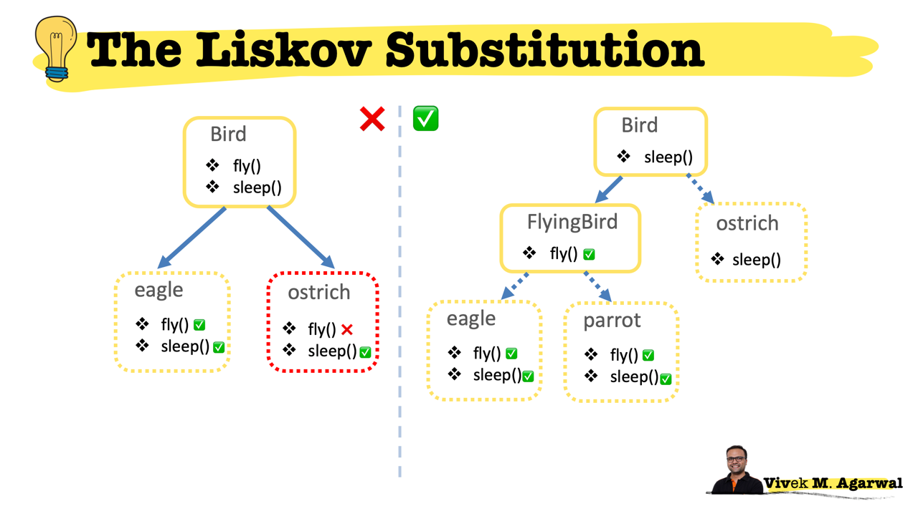

# S  O  L  I  D  Design  Principles

The following 5 **concepts** make up our **SOLID** principles:

**S**ingle Responsibility

**O**pen/Closed

**L**iskov Substitution

**I**nterface Segregation

**D**ependency Inversion


## Single Responsibility

This principle states that a class should only have one responsibility. Furthermore, it should have only one reason to change.

Benifits of the principle:
- **Testing** - Easy to test
- **Lower coupling** - less functionality in a single class
- **Organization** - easier to understand, figure out, manage and refactor
- **separation** of **concerns**

## Open Closed Principle

This priciple states that a classes should be **open** for **extension**, but **closed** for **modification**. In doing so, we stop ourselves from modifying existing class which might have been tested and deployed somewhere. 

## Liskov Substitution principle

This priciple states that if class `S` is a subtype of class `T`, then the objects of type `T` may be replaced with objects of type `S`. object of type `T` may be substituted with any object of subtype `S`. 

In other words, if something is true about the parent, it must be true all the way down the chain.

Let's say we have a (T) class called `Bird` and it can `fly()`; then all the (S) subclasses of Bird like `Eagle` and `Ostrich` must be able to `fly()`;

But here in thid example, we have broken the Liskov Substitution principle as ostrich's dont fly!!



To fix this (one of the many options), we can create a class called `FlyingBird` and move the `fly()` method in the `FlyingBird`. Now all the objects of the `FlyingBird` and the subclasses of the `FlyingBird` would be able to `fly()`.

This principle requires all subclasses to behave in the same way as the parent class. To acheive that, your subclasses need to follow these rules:

- Dont implement any stricter validation rules on input parameters than implemented by the parent class.
- Apply at the least, the same rules to all output parameters as applied by the parent class.

## Interface Segregation Principle

This principle states that the interfaces can be split up into smaller interfaces so that no client should be forced to implement the method they dont use.

Since Javascript doesnot have interfaces, we dont have a straight forward way to enforce them. Surely superclasses can act like a guide.

One way I've seen some people enforcing the implemetation of required functions is by throwing an error in the super class

```
var required = function(){ throw new Error("Implement!"); };
requiredFunction: required;
```

## Dependency Inversion Principle

The general idea of this principle is as simple as it is important: High-level modules, which provide complex logic, should be easily reusable and unaffected by changes in low-level modules, which provide utility features. To achieve that, you need to introduce an abstraction that decouples the high-level and low-level modules from each other.
 